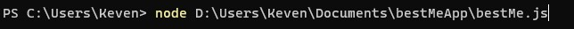
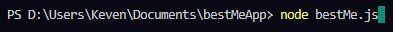

# Best Me APP

O ***Best Me APP*** nada mais é que um sistema simples desenvolvido com *JavaScript*  
enquanto eu acompanhava o módulo de *NodeJS* na *Trilha Fundamentar* da *Rocketseat*.

---

> Para executá-lo é necessário o *NodeJS*...
> No terminal, inserir `node` em seguida o caminho do projeto.

